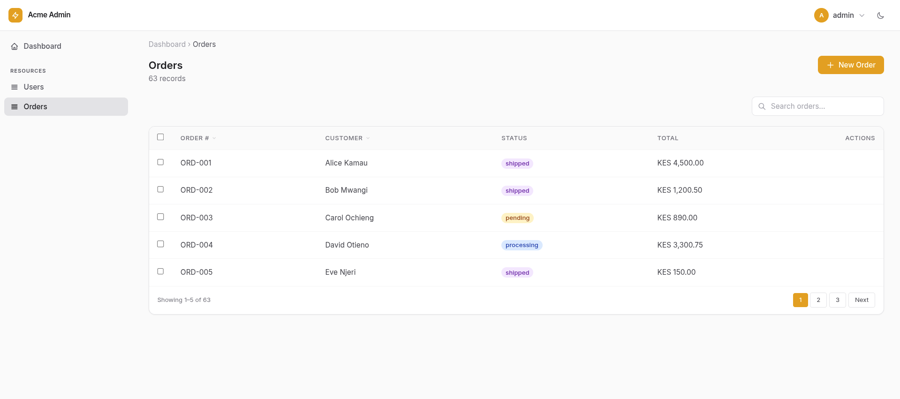

# Nuru
[](https://github.com/coolsam726/nuru/actions)
[](https://www.python.org)
[](https://pypi.org/project/nuru)

A declarative admin panel framework for FastAPI. Define your resources once
in Python — get a full admin UI with tables, forms, search, sorting, and
dashboards. No HTML, no JS, no separate frontend process.



## Installation

```bash
pip install nuru
```

Or from source:

```bash
git clone https://github.com/yourname/nuru
cd nuru
pip install -e .
```

## Drop-in usage

Add three lines to your existing FastAPI project:

```python
from fastapi import FastAPI
from nuru import AdminPanel, Resource

app = FastAPI()          # your existing app — unchanged

# 1. Define a resource
class UserResource(Resource):
    label = "User"
    label_plural = "Users"

    async def get_list(self, *, page, per_page, search, **kwargs):
        users = await user_service.list(page=page, search=search)
        return {"records": users, "total": users.total}

    async def get_record(self, id):
        return await user_service.get(id)

    async def save_record(self, id, data):
        if id is None:
            return await user_service.create(data)
        return await user_service.update(id, data)

    async def delete_record(self, id):
        await user_service.delete(id)

# 2. Create the panel
panel = AdminPanel(
    title="My App",
    prefix="/admin",          # default, change to anything
    brand_color="#6366f1",    # your brand colour
)

# 3. Register resources and mount
panel.register(UserResource)
panel.mount(app)              # attaches to your existing FastAPI app
```

Open `http://localhost:8000/admin` — done.

Nuru **never** touches your existing routes, middleware, OpenAPI
docs, or dependency injection setup. All admin routes are excluded from
your OpenAPI schema by default.

## Resource data hooks

Override these methods to connect your service or ORM layer:

| Method | When called | Must return |
|---|---|---|
| `get_list(page, per_page, search, sort_by, sort_dir, filters)` | List page load & search | `{"records": [...], "total": int}` |
| `get_record(id)` | Edit page load | single record (dict or model) |
| `save_record(id, data)` | Form submit (id=None for create) | saved record |
| `delete_record(id)` | Delete action | None |

Records can be plain `dict`s or any ORM model instance (SQLModel,
SQLAlchemy, dataclass). The template layer handles both transparently.

## Declaring columns and fields

```python
from nuru import columns, fields

class OrderResource(Resource):
    label = "Order"
    label_plural = "Orders"

    table_columns = [
        columns.Text("order_number", "Order #", sortable=True),
        columns.Text("customer", "Customer"),
        columns.Badge("status", "Status", colors={
            "pending": "amber", "shipped": "blue", "delivered": "green",
        }),
        columns.Currency("total", "Total", currency="USD"),
    ]

    form_fields = [
        fields.Text("order_number", required=True),
        fields.Select("status", options=["pending", "processing", "shipped", "delivered"]),
        fields.Textarea("notes"),
    ]
```

## Select / Combobox options

`Select` fields support three option sources:

- **Relationship / model (remote URL):** Point `Select` at a SQLModel class to enable the combobox which queries the built-in `/_model_search` endpoint. Example:

```python
fields.Select(
    "author_id",
    "Author",
    model=Author,           # SQLModel class
    label_field="name",
    relationship="author",  # pre-loaded relation attr for detail display
)
```

- **Static list:** Provide a concrete list of strings or `{value,label}` dicts for a native `<select>`.

```python
fields.Select("status", "Status", options=["draft", "published", "archived"])
```

- **Callable options:** Pass a callable that returns a list of `{value,label}` dicts. The callable is invoked at render time so templates receive concrete option data.

```python
def dynamic_options(record=None):
    # record is the current record being edited (or None for new)
    return [{"value": "a", "label": "Alpha"}, {"value": "b", "label": "Beta"}]

fields.Select("kind", "Kind", options=dynamic_options)
```

Note: callable options are executed synchronously at render time; async callables are not invoked.

## Actions

```python
from nuru import actions, fields

class OrderResource(Resource):
    row_actions = [
        actions.Action(
            key="mark_shipped",
            label="Mark Shipped",
            style="primary",
            confirm="Mark this order as shipped?",
            handler="handle_mark_shipped",
        ),
    ]

    form_actions = [
        actions.Action(
            key="add_note",
            label="Add Note",
            placement="inline",
            form_fields=[fields.Textarea("note", label="Note", required=True)],
            handler="handle_add_note",
        ),
    ]

    async def handle_mark_shipped(self, record_id, data, request):
        # update the record, return optional redirect URL
        ...

    async def handle_add_note(self, record_id, data, request):
        note = data.get("note")
        ...
```

## SQLModel integration

Set `model` and `session_factory` for zero-boilerplate CRUD — columns and
fields are auto-generated from model annotations:

```python
from nuru import AdminPanel, Resource
from nuru.migrations import sync_schema

class UserResource(Resource):
    label = "User"
    label_plural = "Users"
    model = User                    # your SQLModel class
    session_factory = get_session   # async context-manager factory
    search_fields = ["name", "email"]
```

## Authentication

### Simple (single-user)

```python
from nuru import AdminPanel
from nuru.auth import SimpleAuthBackend

panel = AdminPanel(
    title="My App",
    prefix="/admin",
    auth=SimpleAuthBackend(
        username="admin",
        password="secret",
        secret_key="change-me-in-production",
    ),
)
```

`SimpleAuthBackend` signs a session cookie with `itsdangerous`. Because there is only one user with no `_permissions` key, the built-in `default_permission_checker` grants **full access** — no permission setup required.

---

## Roles & Permissions

Nuru includes a Spatie-style Role/Permission system for multi-user panels.

### How it works

| Concept | Description |
|---|---|
| **Permission** | Fixed codename scoped to a resource+action, e.g. `users:list`, `orders:delete` |
| **Role** | User-defined group of permissions (many-to-many) |
| **UserRole** | Which roles a user holds (many-to-many, user identified by `str(pk)`) |

At runtime, nuru checks **permissions** — not role names, which can change freely.

### Codename format

`{resource_slug}:{action}` — e.g.:

| Codename | Meaning |
|---|---|
| `users:list` | Browse the Users list page |
| `users:create` | Create a new User |
| `users:edit` | Edit an existing User |
| `users:view` | View User detail |
| `users:delete` | Delete a User |
| `users:action` | Run any row/list action on Users |
| `users:action:export_csv` | Run the specific `export_csv` action only |
| `users:*` | All actions on Users |
| `*` | Superuser — everything |

### Setup

```python
import nuru.roles  # registers the 4 nuru_* tables with SQLModel.metadata
from nuru import AdminPanel, DatabaseAuthBackend, db_permission_checker
from passlib.context import CryptContext

_pwd = CryptContext(schemes=["bcrypt"])

panel = AdminPanel(
    title="My App",
    prefix="/admin",
    auth=DatabaseAuthBackend(
        user_model=User,
        session_factory=get_session,
        username_field="email",
        password_field="password",
        verify_password=_pwd.verify,   # omit for plaintext (dev only)
        secret_key="change-me-in-production",
        extra_fields=["name"],         # extra User fields to expose in templates
    ),
    permission_checker=db_permission_checker,
)
```

At startup, sync the schema **and** upsert permission rows:

```python
from nuru.migrations import sync_schema

@app.on_event("startup")
async def on_startup():
    await sync_schema(engine, SQLModel.metadata)   # creates nuru_* tables too
    await panel.sync_permissions(get_session)      # upserts permission codenames
```

### Seeding roles programmatically

```python
from nuru.roles import Permission, Role, RolePermission, UserRole

async def seed_roles(session):
    admin_role = Role(name="Super Admin", description="Full access")
    viewer_role = Role(name="Read Only",  description="View only")
    session.add_all([admin_role, viewer_role])
    await session.flush()

    star = (await session.exec(select(Permission).where(Permission.codename == "*"))).first()
    session.add(RolePermission(role_id=admin_role.id, permission_id=star.id))

    view_perms = (await session.exec(
        select(Permission).where(Permission.codename.in_(["users:list", "users:view"]))
    )).all()
    for p in view_perms:
        session.add(RolePermission(role_id=viewer_role.id, permission_id=p.id))

    # Assign a role to a user
    session.add(UserRole(user_id=str(user.id), role_id=admin_role.id))
    await session.commit()
```

### Custom permission checker

Pass any `(user, codename, resource) -> bool` callable (sync or async) to override the built-in logic:

```python
async def my_checker(user, codename, resource):
    if user is None:
        return False
    if user.get("is_superuser"):
        return True
    return codename in user.get("_permissions", set())

panel = AdminPanel(
    auth=...,
    permission_checker=my_checker,
)
```

## Configuration

```python
AdminPanel(
    title="Acme Admin",       # shown in sidebar header and browser tab
    prefix="/admin",          # URL prefix for all admin routes
    brand_color="#6366f1",    # hex colour for sidebar and buttons
    logo_url="/static/logo.png",  # optional logo, replaces text title
    per_page=25,              # default pagination size
)
```

## Running the example app

```bash
git clone https://github.com/yourname/nuru
cd nuru
pip install -e .

# Build the Tailwind CSS (requires Node ≥ 18)
npm install
npm run build:css

uvicorn example_app.main:app --reload
# open http://localhost:8000/admin
```

> **Developing?** Run `npm run watch:css` in a second terminal while uvicorn is running to rebuild the stylesheet automatically as you edit templates.

## CSS build

Nuru uses **Tailwind CSS v4** compiled to a single static file (`nuru/static/tailwind.css`) shipped with the package. The pre-built stylesheet is committed to the repo so end-users need no Node toolchain to *use* Nuru — only contributors who edit templates need to rebuild it.

| Command | Effect |
|---|---|
| `npm install` | Install `tailwindcss` + `@tailwindcss/cli` |
| `npm run build:css` | One-off minified build → `nuru/static/tailwind.css` |
| `npm run watch:css` | Rebuild on every template save |

The input CSS lives at `nuru/static/tailwind.input.css` and uses Tailwind 4's CSS-first configuration. All Tailwind theme colors (`--color-indigo-500`, `--color-gray-200`, etc.) are exposed as native CSS custom properties on `:root` by the built stylesheet — no JavaScript probing needed.

## Custom Tailwind classes

Nuru's pre-built `tailwind.css` only scans Nuru's own templates. If your `Resource`, `Page`, or custom Jinja templates use Tailwind utility classes that aren't already present in Nuru's templates, those classes won't be included in the built stylesheet.

### Option 1 — supplemental stylesheet (recommended)

Build a second, project-level stylesheet that covers only your application code, then pass it to `AdminPanel` via `extra_css`:

```css
/* my_app/static/admin-extra.input.css */
@import "tailwindcss";

/* Point at your own code */
@source "../**/*.py";
@source "../templates/**/*.html";

@variant dark (&:where(.dark, .dark *));
```

```bash
# reuse Nuru's node_modules, or install tailwindcss in your project
./node_modules/.bin/tailwindcss \
  -i my_app/static/admin-extra.input.css \
  -o my_app/static/admin-extra.css \
  --minify
```

```python
# app setup
panel = AdminPanel(
    prefix="/admin",
    extra_css="/static/admin-extra.css",          # single URL
    # extra_css=["/static/a.css", "/static/b.css"],  # or a list
)
```

The `extra_css` stylesheets are loaded **after** Nuru's stylesheet, so your utilities can safely complement or override it.

### Option 2 — replace Nuru's stylesheet entirely

If you prefer a single request, build one stylesheet that covers both Nuru's templates and your own code, then serve it at `{prefix}/static/tailwind.css` via a higher-priority `StaticFiles` mount:

```css
/* my_app/static/tailwind.input.css */
@import "tailwindcss";

/* Nuru's own templates */
@source "/path/to/site-packages/nuru/templates/**/*.html";

/* Your application code */
@source "../**/*.py";
@source "../templates/**/*.html";

@variant dark (&:where(.dark, .dark *));
```

Build and mount before Nuru's route:

```python
from starlette.staticfiles import StaticFiles

app.mount("/admin/static", StaticFiles(directory="my_app/static"), name="admin-static")
```

## File Upload

Nuru's `FileUpload` field is powered by [FilePond](https://pqina.nl/filepond/) (loaded from CDN — no build step needed) and inspired by [FilamentPHP's FileUpload](https://filamentphp.com/docs/5.x/forms/file-upload).

```python
from nuru.forms import FileUpload

form_fields = [
    # Single image upload with preview and crop
    FileUpload("avatar")
        .label("Profile Photo")
        .image()                                      # enable image preview plugin
        .directory("avatars")                         # stored in uploads/avatars/
        .accept_file_types(["image/jpeg", "image/png", "image/webp"])
        .max_file_size(2 * 1024 * 1024)               # 2 MB
        .image_crop_aspect_ratio("1:1")
        .required(),

    # Multiple PDF attachments
    FileUpload("documents")
        .label("Attachments")
        .multiple()
        .max_files(5)
        .accept_file_types(["application/pdf"])
        .max_file_size(10 * 1024 * 1024),             # 10 MB per file
]
```

### Storage backend

By default Nuru saves files under `./uploads/` relative to the current working directory. Configure a different path via `AdminPanel`:

```python
from pathlib import Path
from nuru.storage import LocalFileBackend

panel = AdminPanel(
    title="My App",
    prefix="/admin",
    upload_backend=LocalFileBackend(Path("/var/www/myapp/media")),
)
```

Uploaded files are served at `{prefix}/uploads/<server_id>` automatically.

### How it works

1. User drops a file on the FilePond widget.
2. FilePond `POST`s the file to `{prefix}/_upload?directory=<dir>`.
3. Nuru saves it via the storage backend and returns a plain-text **server ID** (relative path).
4. FilePond stores the server ID in a hidden `<input name="{key}">`.
5. On form submit, `parse_form` reads the server ID(s) and stores them as the field value.
6. In edit mode, the existing server ID is passed back to FilePond so the thumbnail is pre-populated.

| Method | Description |
|---|---|
| `.image()` | Enable image preview + EXIF orientation fix |
| `.multiple()` | Allow multiple file selection |
| `.max_files(n)` | Limit number of files (requires `.multiple()`) |
| `.accept_file_types([...])` | List of MIME types to accept |
| `.max_file_size(bytes)` | Maximum file size in bytes |
| `.directory("path")` | Sub-directory under upload root |
| `.image_crop_aspect_ratio("1:1")` | Lock crop to a ratio |
| `.image_resize(width, height, mode)` | Resize image client-side before upload |
| `.can_reorder(True)` | Allow drag-to-reorder in FilePond |
| `.can_download(True)` | Show download button (default: `True`) |

## Forms API

### TextInput — the canonical single-line input

`TextInput` is the modern base class for all single-line text inputs.  `Email`
and `Password` inherit from it; `Text` is kept as a backwards-compatible alias.

```python
from nuru.forms import TextInput

# Fluent factory — returns the correct concrete type
TextInput.make("email").email().label("Email").required().placeholder("you@example.com")
TextInput.make("secret").password().label("Password").required()

# In-place fluent style (also works)
TextInput("username").label("Username").max_length(64).required()
```

`Field.make()` is available on **every** field class (it lives on the base
`Field`).  Calling `.email()` or `.password()` on a factory-created instance
returns a concrete `Email` / `Password` instance with all fluent settings copied
over.

### Server-side field validation

Nuru validates every form submission on the server before calling
`save_record()`.  Validation errors are returned as field-level messages inside
the existing form UI (HTTP 422, no separate error page).

Validators are declared fluently on each `Field`:

| Validator | How to enable | What it checks |
|---|---|---|
| required | `.required()` | Non-empty value present |
| max_length | `.max_length(n)` | String length ≤ n characters |
| email | `.email()` (or `add_validator("email")`) | Basic RFC-style `user@host.tld` pattern |
| url | `.url()` (or `add_validator("url")`) | Has scheme + netloc via `urlparse` |
| numeric | `add_validator("numeric")` | Value is float-coercible |
| integer | `add_validator("integer")` | Value is int-coercible (no decimals) |

The same validation also fires for **Action modal fields** (`Action.form_fields`)
before the action handler is called.

## What's shipped

- ✅ **Core CRUD** — tables, forms, detail views
- ✅ **Typed columns** — `Text`, `Badge`, `Currency`, `DateTime`, `Boolean`
- ✅ **Typed fields** — `TextInput` (+ legacy `Text`), `Email`, `Password`, `Number`, `Textarea`, `Select`, `Checkbox`, `Date`, `Time`, `Hidden`, `DatePicker`, `DateTimePicker`, `TimePicker`, **`FileUpload`**
- ✅ **File upload (FilePond)** — drag-and-drop, image preview, content-type and size validation, single/multiple file modes, pluggable storage backends (`LocalFileBackend`; S3-ready interface)
- ✅ **Field.make() factory** — fluent factory with `.email()`, `.password()`, `.url()`, `.numeric()`, `.integer()` convenience methods
- ✅ **Server-side validation** — required, max_length, email, url, numeric, integer; field-level errors in the form UI
- ✅ **Alpine.js 3.x** — all client-side interactivity (sidebar, theme toggle, dialog, combobox) powered by Alpine; plain JS removed
- ✅ **HTMX interactions** — live search, sort, pagination without page reloads
- ✅ **Actions** — row actions, list actions, form actions, confirm modals, action forms
- ✅ **SQLModel integration** — auto-CRUD and auto-generated columns/fields
- ✅ **Auth** — signed-cookie session, `SimpleAuthBackend`, `DatabaseAuthBackend`, pluggable `AuthBackend`
- ✅ **Roles & Permissions** — `Permission`, `Role`, `RolePermission`, `UserRole` tables; `db_permission_checker`; `panel.sync_permissions()`; role/permission assignment API
- ✅ **Role management UI** — permission checkbox grid and user-role assignment directly from the admin panel
- ✅ **Dark mode** — built-in, localStorage-persisted
- ✅ **Responsive** — mobile sidebar, Tailwind CSS
- ✅ **Components** — `Radio`, `RadioButtons`, `Toggle`, `Timepicker` via `nuru.components`

## What's coming

- **Dashboard widgets** — stat cards, line charts, pie charts

## Feature plan (roadmap)

The following is a prioritized plan for the next phases of Nuru. It lists features, a short design summary for each, and recommended first steps so we can make incremental, testable progress.

1) Fields (high priority)
   - File upload (`nuru/forms/file.py`) — pluggable storage backend, preview, direct (AJAX) and form-submit modes. Implement a simple `LocalFileBackend` and a `{prefix}/_upload` endpoint. Store file reference (path/URL) on the record and provide secure preview URLs.
   - Image upload — build on `File`, add optional thumbnail generation (Pillow optional dependency) and image previews.
   - Repeater — repeatable sub-forms; recommend JSON-backed client state (Alpine) to simplify server parsing and validation.
   - CheckboxList / Multi-select — renderable as either native `<select multiple>` or checkbox groups, returning lists of values.
   - Markdown & Rich text editors — thin integrations (Markdown textarea + live preview; optional Quill/Tiptap integration for rich HTML output). Provide server-side sanitization hooks.

2) Reactivity (client + server)
   - Alpine-powered reactive form store: expose `form` as an Alpine object (`x-data`) so fields can bind via `x-model="form[key]"`.
   - Declarative field-level rules: `depends_on`, `visible_when`, `compute`, `set_on_change`. These render as Alpine bindings (x-show, x-bind etc.) for immediate UX and are mirrored with lightweight server-side checks to prevent bypass.
   - Server mirror: simple rule DSL (tuples or callables) enforced during `Resource._validate_fields` to ensure hidden/disabled fields cannot be abused.

3) Actions & UX improvements
   - Action modal validation UX — return JSON `{errors: {...}}` (HTTP 422) on validation failure and display inline errors inside the Alpine modal instead of rendering a full error page.
   - Support for long-running action handlers (background job hooks, optional task queue integration).

4) Widgets & Dashboard
   - Widget API for stat cards and charts, pluggable chart adapters (default: Chart.js via CDN). Widgets register with the panel and render on a dashboard grid.

5) Polishing, Tests & Docs
   - Add unit and integration tests for all new fields and validation flows (examples under `tests/`).
   - Expand docs with examples showing File/Image uploads, Repeater, and reactive field rules.

Recommended first task

Start with the `File` upload field. It unlocks image uploads and establishes patterns for storage, previews, and validation.

Minimal implementation checklist for `File`:
- Add `nuru/forms/file.py` with `File` field class (accept, multiple, max_size).
- Add `nuru/storage/local.py` `LocalFileBackend` implementing `save_upload(fileobj, filename) -> dict(url,path,meta)`.
- Expose `AdminPanel(upload_backend=...)` option and default to `LocalFileBackend` with a safe project-local uploads directory.
- Add an upload endpoint at `/{prefix}/_upload` that accepts multipart uploads and returns JSON `{url,path,meta}` for direct/AJAX uploads.
- Add `components/partials/fields/form/file.html` — Alpine-powered preview and optional direct upload integration.
- Update `resource.parse_form` to detect `UploadFile` objects and call `panel.upload_backend.save_upload` before validation/saving.
- Add tests: `tests/test_file_field.py` for form-submit and direct upload, and validation (content type, max size).

Timeline (rough)
- File upload (basic) + tests: 1–2 days
- Image upload + thumbnails: 1 day (+ Pillow)
- Repeater: 1–2 days
- Reactive rules + server mirror: 2–3 days

How I can proceed

If you'd like I can implement the `File` field now (local-only backend to start). Confirm if you want the uploads directory to be inside the project (default) or point at a specific absolute path. I will then create the files, run tests, and push the changes to the current branch.


